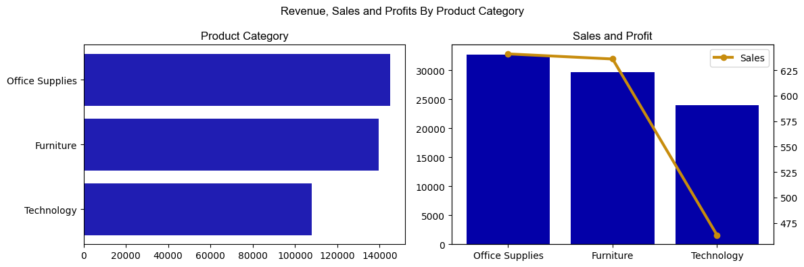
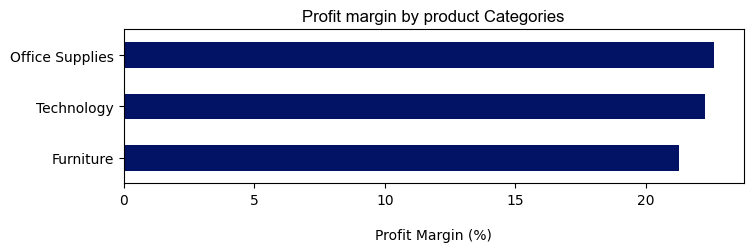
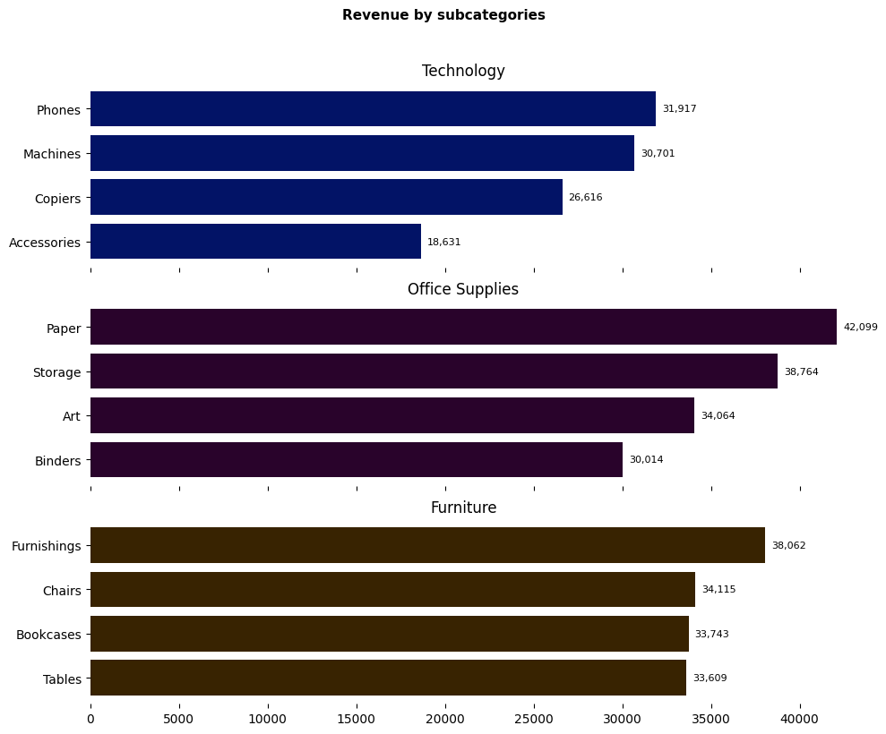
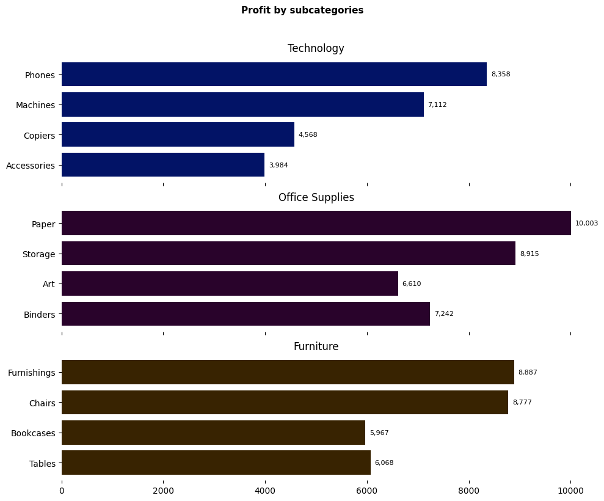
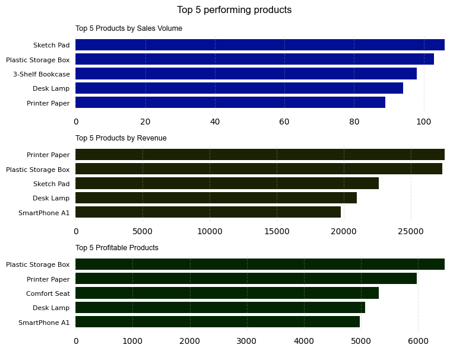
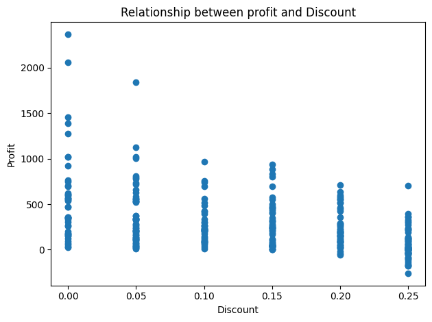
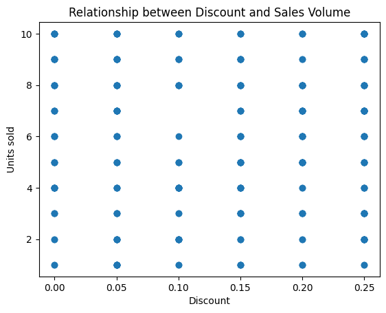
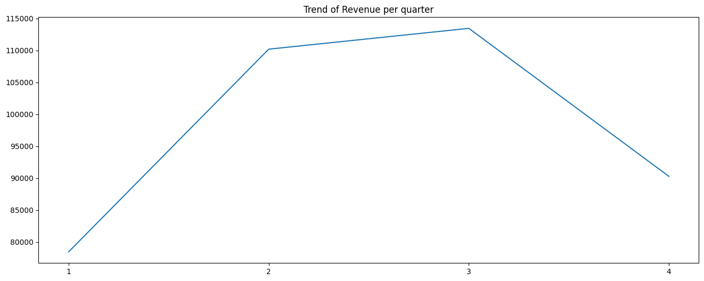
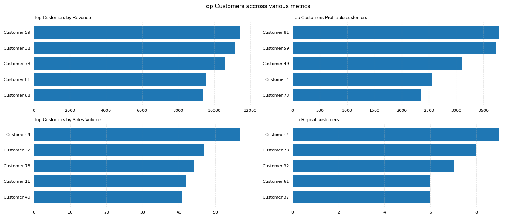

## SALES PERFORMANCE ANALYSIS REPORT

### PROJECT OVERVIEW

This project analysis one year sales data of a store to understand customer choices and behavior in order to generate insights which will improve sales, revenue and guide stakeholders in making critical decisions.

### DATASET OVERVIEW

- Total Records: 300
- Period: January, 2023 - December, 2023
- Number of Rows: 13
- Regions: 4

### KEY COLUMNS

- Customer Name
- Region
- Product Category
- Units sold
- Discount
- Revenue
- Profit

### TOOLS AND SKILLS

- Excel (Data Inspection)
- SQL (For data exploration and analysis)
- Python Pandas
- Matplotlib.pyplot
- Business insights

### DATA EXPLORATION

#### SALES, REVENUE AND PROFIT

- Total Sales: **1,740**
- Total Revenue: **392,334.83**
- Total Profit: **86,492.09**
- Overall Profit Margin: **22.85%**

#### REGIONAL PERFORMANCE

- Eastern Region led in Revenue Generation
- Eastern Region led in Profitability
- Western region led in sales but lags behind in other profitability and revenue metrics coming 3rd and 2nd respectively.
- Efforts should be increased to expand the market in other to take in high profit products to the western region.
- Northern region recorded the lowest sales, profit and revenue.
- The Southern region shows a promising market with a better sales performance than the East, lower revenue but significant Profit.
- Data demonstrates that Revenue and Sales does are not directly proportional to profitability.

#### PRODUCT CATEGORY PERFORMANCE

- Office supplies is the best performing product category
- Office supplies tops the charts for sales, revenue and profit.
- The least profit, sales and revenue came from the Technology category
- Despite being the last on the list, Technology comes second in profit margin, with little difference with the chart topper "office Supplies"; signifying premium sales.

#### PRODUCT SUB-CATEGORY PERFORMANCE

A deeper dive into the subcategories to understand where the profits and revenue comes from.

- Office papers make the highest Revenue and Profit.
- Technology accessories generate the lowest Revenue and profit.

#### PRODUCT PERFORMANCE

- Data from top 5 products continue to show no positive relationship between Sales, Revenue and Profit.
- Number one sold Item did not appear in the top profit and revenue chart.

#### DISCOUNT

  
region.png>)  
  

- Discount played no role in increasing or decreasing sales.
- Profit was negatively affected by discount, with higher discount leading to negative profit.
- Discount should be revaluated to ensure that it drives sales and increases revenue and sales.

#### MONTHLY AND QUARTERLY TREND

  

- Sales are very low on the first quarter, hikes in the second and third, goes back down in the 4th quarter.
- Monthly Trend shows a high revenue yield in December with the highest between August and september.
- Revenue is lowest in January.

#### TOP CUSTOMERS

Top Customers across different metrics.
